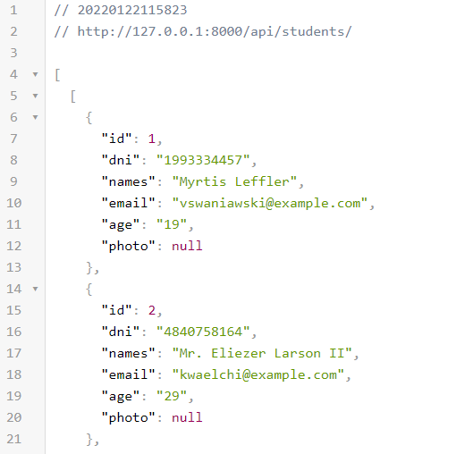

## About Laravel

Laravel is a web application framework with expressive, elegant syntax. We believe development must be an enjoyable and creative experience to be truly fulfilling. Laravel takes the pain out of development by easing common tasks used in many web projects, such as:

- [Simple, fast routing engine](https://laravel.com/docs/routing).
- [Powerful dependency injection container](https://laravel.com/docs/container).
- Multiple back-ends for [session](https://laravel.com/docs/session) and [cache](https://laravel.com/docs/cache) storage.
- Expressive, intuitive [database ORM](https://laravel.com/docs/eloquent).
- Database agnostic [schema migrations](https://laravel.com/docs/migrations).
- [Robust background job processing](https://laravel.com/docs/queues).
- [Real-time event broadcasting](https://laravel.com/docs/broadcasting).

Computer Version:

> <strong> This laravel project is an api that allows you to save information about a student with their respective avatar</strong>

 

## 💻 Pre requirements
 

To use the project on your machine, you must have the following installed:

* Have a local server installed (Xampp, Lamp, Laragon, among others).
* Check if the installer server has PHP higher than 7.4 and MYSQL higher than 5.7.
* Have composer greater than 2.0 installed.

## 📫 Start project <laravel_apistudents>

To start the project <laravel_apistudents>, you must follow the following steps:

> Linux - macOS:

1. composer install
2. cp .env.example .env
3. php artisan key:generate
4. configure the database connection credentials in the .env
5. sudo chmod -R 755 storage
6. php artisan migrate:fresh --seed
7. php artisan storage:link
8. php artisan serve

> Windows:

1. composer install
2. copy .env.example .env
3. php artisan key:generate
4. configure the database connection credentials in the .env
5. php artisan migrate:fresh --seed
6. php artisan storage:link
7. php artisan serve

## 🚀 Start the service on the route: 
> [http://127.0.0.1:8000/api/students/](http://127.0.0.1:8000/api/students/)

## License

The Laravel framework is open-sourced software licensed under the [MIT license](https://opensource.org/licenses/MIT).

### My social accounts

<strong>Copyright © 2022 Harlericho</strong>

